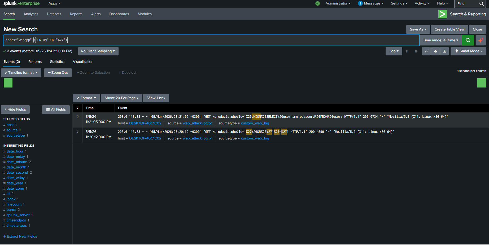
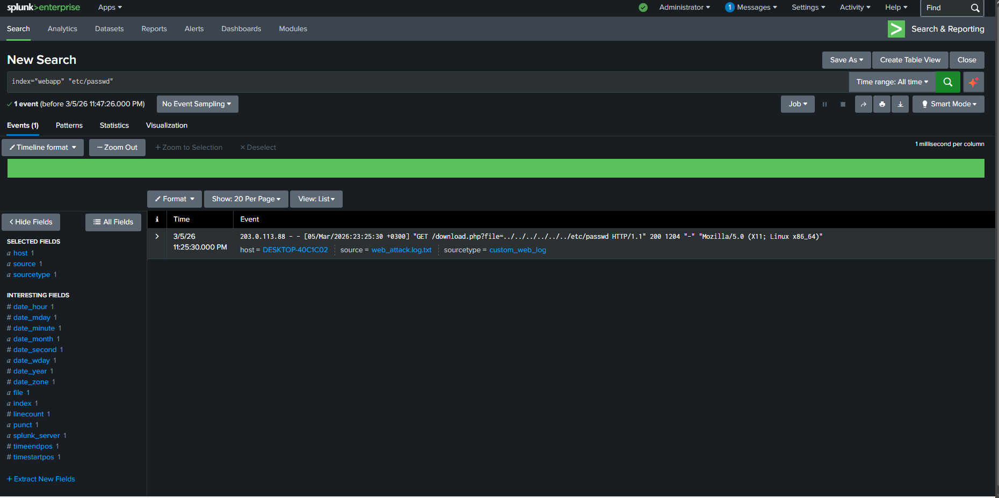
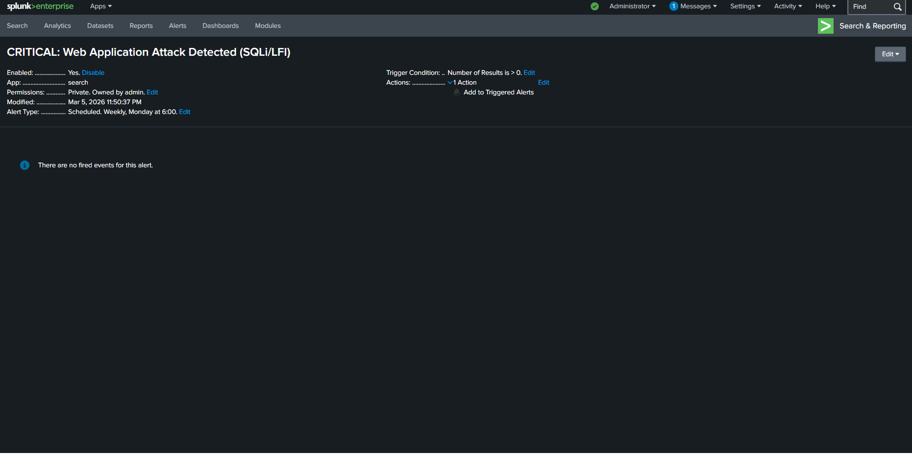

# Splunk Detection Engineering: Web Threat Analysis (SQLi & LFI)
*Turkish translation is available below / Türkçe çevirisi aşağıdadır.*

## 🇬🇧 English - Objective
This project demonstrates a **Detection Engineering** approach to identifying critical web application attacks. Instead of parsing through gigabytes of noisy production data, I generated synthetic Apache access logs (Proof of Concept) containing specific attack vectors. This isolated environment allowed me to build, test, and validate custom Splunk Processing Language (SPL) correlation rules with absolute precision before considering them for a production SIEM deployment.

### Tools & Environment
* **SIEM:** Splunk Enterprise
* **Log Source:** Custom Synthetic Apache Access Logs
* **Threats Analyzed:** SQL Injection (SQLi) and Local File Inclusion (LFI)

### Step 1: SQL Injection (SQLi) Detection
Attackers often use URL-encoded characters (like `%27` for single quotes) or database commands (like `UNION`) to manipulate backend databases. I crafted an SPL query to isolate these specific attempts.
* **Query:** `index="webapp" ("UNION" OR "%27")`

### Step 2: Local File Inclusion (LFI) Detection
To detect directory traversal attempts aimed at reading sensitive system files, I hunted for specific paths (like `etc/passwd`) within the web requests.
* **Query:** `index="webapp" "etc/passwd"`

### Step 3: Correlation Rule & Alert Configuration
To avoid alert fatigue, I combined these threat vectors into a single, high-fidelity correlation rule. I then configured a high-severity automated alert that triggers whenever these critical web attack patterns are detected.
* **Correlation Query:** `index="webapp" ("UNION" OR "%27" OR "etc/passwd")`
* **Alert Title:** CRITICAL: Web Application Attack Detected (SQLi/LFI)

## Conclusion
This lab highlights the ability to simulate attack traffic, write precise SPL queries, and engineer custom correlation alerts to detect advanced web threats, showcasing a proactive and analytical approach to SIEM rule development.

---

## 🇹🇷 Türkçe - Amacımız
Bu proje, web uygulamalarındaki kritik saldırıları yakalamak için **Tespit Mühendisliği (Detection Engineering)** yaklaşımını temel alıyor. Milyonlarca satırlık canlı sistem logları içinde boğulmak yerine, spesifik saldırı vektörlerini içeren kendi Apache loglarımı ürettim (Proof of Concept). Bu izole laboratuvar ortamı, hazırladığım SPL korelasyon kurallarını canlı SIEM ortamına almadan önce güvenli bir şekilde test edip doğrulamamı sağladı.

### Araçlar ve Ortam
* **SIEM:** Splunk Enterprise
* **Log Kaynağı:** Özel Üretilmiş Sentetik Apache Logları
* **İncelenen Tehditler:** SQL Injection (SQLi) ve Local File Inclusion (LFI)

### 1. Aşama: SQL Injection (SQLi) Tespiti
Saldırganlar veritabanlarını manipüle etmek için genellikle URL-encoded karakterler (`%27` gibi) veya `UNION` gibi komutlar kullanır. Splunk üzerinde bu spesifik denemeleri yakalayacak bir SPL sorgusu hazırladım.
* **Sorgu:** `index="webapp" ("UNION" OR "%27")`

### 2. Aşama: Local File Inclusion (LFI) Tespiti
Sistemdeki hassas dosyaları okumaya yönelik "directory traversal" (dizin atlama) girişimlerini yakalamak için, web isteklerinin içindeki `etc/passwd` gibi kritik dosya yollarını aradım.
* **Sorgu:** `index="webapp" "etc/passwd"`

### 3. Aşama: Korelasyon Kuralı ve Alarm Kurulumu
Gereksiz alarm kalabalığını (alert fatigue) önlemek için bu iki tehdit vektörünü tek ve net bir korelasyon kuralında birleştirdim. Ardından, bu saldırı kalıpları eşleştiği an tetiklenecek "High-Severity" seviyesinde otomatik bir alarm oluşturdum.
* **Korelasyon Sorgusu:** `index="webapp" ("UNION" OR "%27" OR "etc/passwd")`
* **Alarm Başlığı:** CRITICAL: Web Application Attack Detected (SQLi/LFI)

## Sonuç
Bu laboratuvar; saldırı trafiğini simüle etme, nokta atışı SPL sorguları yazma ve gelişmiş web tehditlerini yakalamak için korelasyon alarmları oluşturma becerilerini öne çıkarıyor. SIEM kural geliştirme süreçlerine analitik ve proaktif bir yaklaşım sunuyor.
